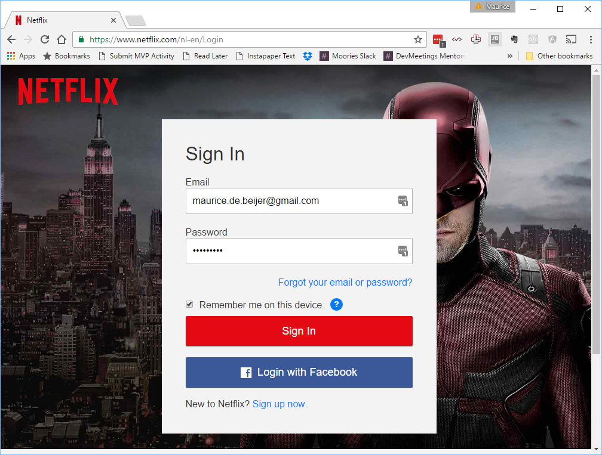

# Lab instructions

1. Install development environment
    1. Install Node + NPM
    1. Install create-react-app using `npm install create-react-app -g`
    1. Make sure you have an editor you can use. For example Sublime, Visual Studio Code, Atom, Webstorm or something similar
1. Create and run a basic React app
    1. `create-react-app nitflex`
    1. `cd nitflex`
    1. Creating a new Git repository here and adding all the files with an initial commit is higly recommended. If you do so commit 
    all changes after every change made during this lab.
    1. `npm start`
    1. The browser should appear at http://localhost:3000/ with a "Welcome to React" message and logo
1. Look at Netflix main landing page when not logged in
    1. The main page has a Signin button. In this lab we are not going to implement real security. 
    We will add the signin button to log in with a hard coded user. This user object will be stored in the application state.
    

1. Look at Netflix main landing page after loggin in
    1. There is a top bar with amongst other things a search field and the user with a logout option
    1. There is a Jumbotron/Hero images highlighting one title. This includes a play button.
    

    1. There is a vertical list of categories
    1. Each categorie has a horizontal list of titles.
    1. Each title has an image like http://image.tmdb.org/t/p/w300/6bbZ6XyvgfjhQwbplnUh1LSj1ky.jpg and title
    

    1. Hovering over a title image makes it larger
    
    1. Clicking on the down arrow shows more info about the title
    
    1. Clicking on the play button starts the player in full screen
1. We will use Bootstrap as our CSS framework
    1. `npm install bootstrap --save`
    1. Remove existing import of CSS file
    1. Import Bootstrap CSS with `import '../node_modules/bootstrap/dist/css/bootstrap.min.css';
import '../node_modules/bootstrap/dist/css/bootstrap-theme.min.css';`
1. Create main layout in App.js. 
    1. Render a wrapping div with class container
    1. Add user property as state, default to null
    1. Render LoginPage if user is null. Pass loginAsUser() function to LoginPage so it can alter the state.
    1. Render MainPage is user is set
1. Login in each time isn't very nice
    1. Add "Remember me on this device"
    1. Save user in `localStorage` if set
    1. In `componentDidMount()` check `localStorage` for user and set if there. 

